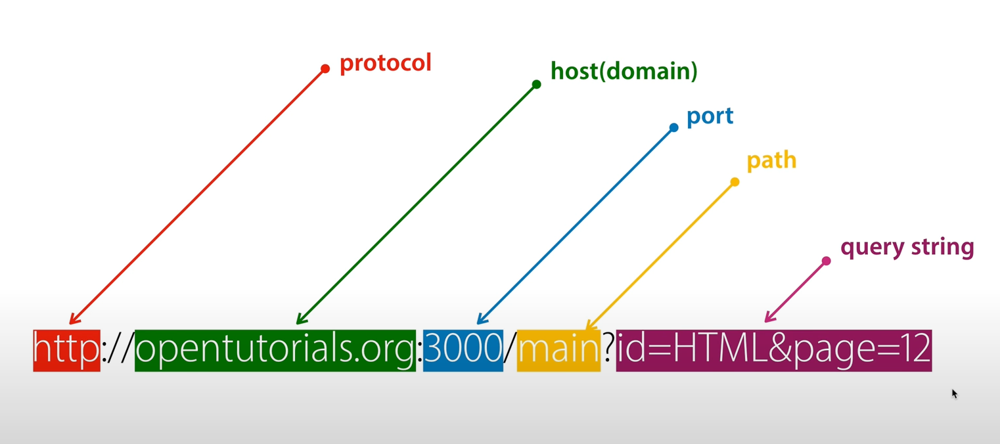
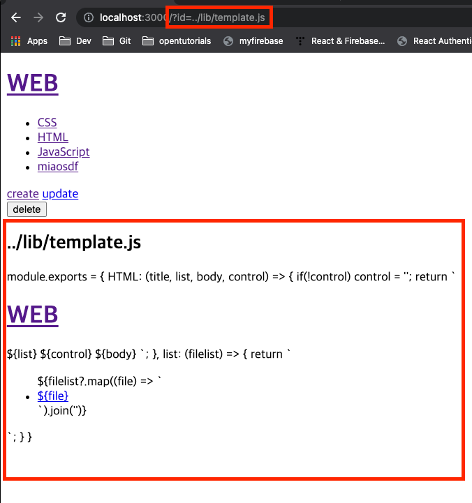
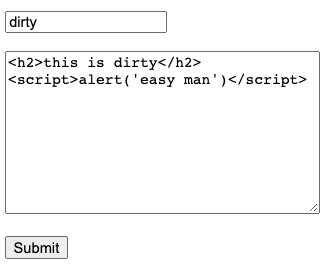

# Node.js


## Start Server 
`node main.js`
***
### URL 구조 </br>


+ ### URL로 입력된 값 사용하기</br>
```javascript
const url = require('url');
const queryData = url.parse(_url, true).query;
````
***
+ ### post data 받는 작업
```javascript
let body = '';
request.on('data', (data) => {
    body += data;
    // Note data 양이 너무 많을경우 접속을 끊어버림 (보안장치)
    if(body.length > 1e6) request.connection.destroy();
     
})
```
***
+ ### 파일 생성 
```javascript
const qs = require('querystring');
request.on('end', () => {
    const post = qs.parse(body);
    const title = post.title;
    const description = post.description;
    // 파일 생성
    fs.writeFile(`data/${title}`, description, 'utf8', (err) => {
        if(err) throw err;
        else {
            // Note 302는 리다이렉션을 뜻한다 
            // 성공하면 생성된 페이지로 이동
            response.writeHead(302, {Location: `/?id=${title}`});
            response.end();
        }
    })
})
```
***
+ ### 파일 업데이트
```javascript
// 이전값을 post id에 담아 보낸다.
    <input type="hidden" name="id" value="${title}"/>
    // 이전값을 새로운 값으로 rename 한다.
    fs.rename(`data/${id}`, `data/${title}`, (err) => {
        // 내용을 업데이트 한다
        fs.writeFile(`data/${title}`, description, 'utf8', (err) => {
            if (err) throw err;
            else {
                response.writeHead(302, {Location: `/?id=${title}`});
                response.end();
            }
        })
    })
```
***
+ ### 파일 삭제 
    + 삭제는 반드시 링크가 아닌, post로 전송해야한다. 
```javascript
<a href="/create">create</a>
<a href="/update?id=${title}">update</a> 
<form action="delete_process" method="post">
    <input type="hidden" name="id" value="${title}"/>
    <input type="submit" value="delete"/>
</form>
                    
fs.unlink(`data/${id}`, (err) => {
    if (err) throw err;
    else {
        response.writeHead(302, {Location: '/'});
        response.end();
    }
})
```
***
## Security
- ### Issue 입력정보에 대한 보안</br>
<code>
  <span style="display: flex">
  
  
  </span>
</code>

+ ### 출력정보에 대한 보안</br>
<code></code>

> `sanitize html`을 통하여 외부입력을 방어
