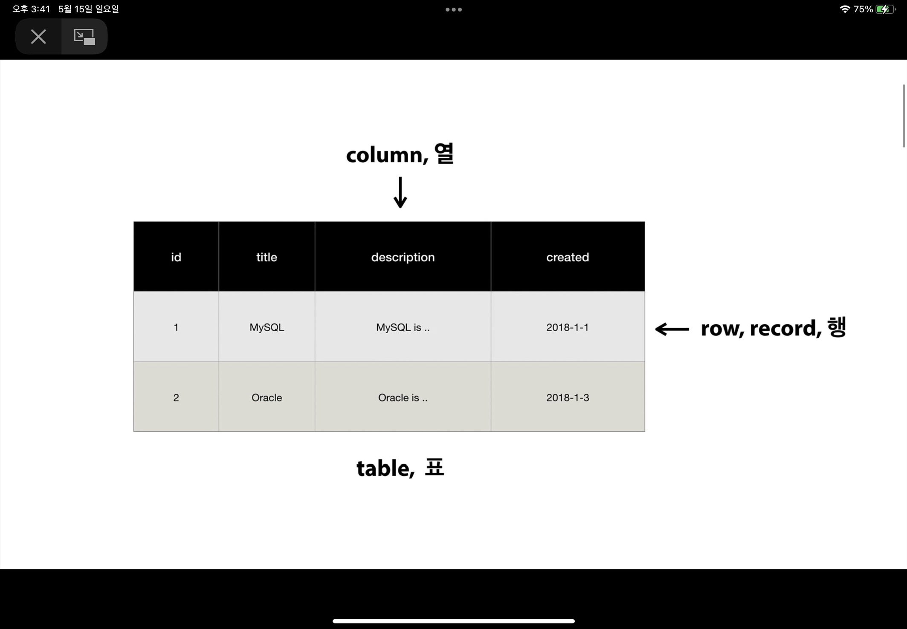

# mySQL
***
## **S**tructured **Q**uery **L**anguage
***
### TABLE

> - **row**, record, 행 => 데이터 자체
> - **column**, 열 => 데이터의 타입, 구조
***
### 명령어
> - 데이터베이스 생성 `CREATE DATABASE $name;`
> - 데이터베이스 삭제 `DROP DATABASE $name;`
> - 데이터베이스 목록보기 `SHOW DATABASES;`
> - 데이터베이스 사용 `USE $name;`
>   + 앞으로의 명령문은 사용을 선택한 데이터베이스에 할당한다. 

> - 테이블 생성 (컬럼) 
>   + `CREATE TABLE $tableName(PRIMARY KEY(k), column1 DATATYPE(v), column2...);`
> - 데이터 타입 옵션  
>   + 입력을 강제 `DATATYPE(v) NOT NULL`
>   + 자동증가 `NOT NULL AUTO_INCREMENT`
>   + 값 없음 허용 `NULL`

> - 데이터 추가 (로우) 
>   + `INSERT INTO $tableName (column1, column2, ...) VALUES('value1','value2' ...)`

> - 테이블 구조 보기 `DESC $tableName`
> - 테이블 데이터 읽기 `SELECT * FROME $tableName`